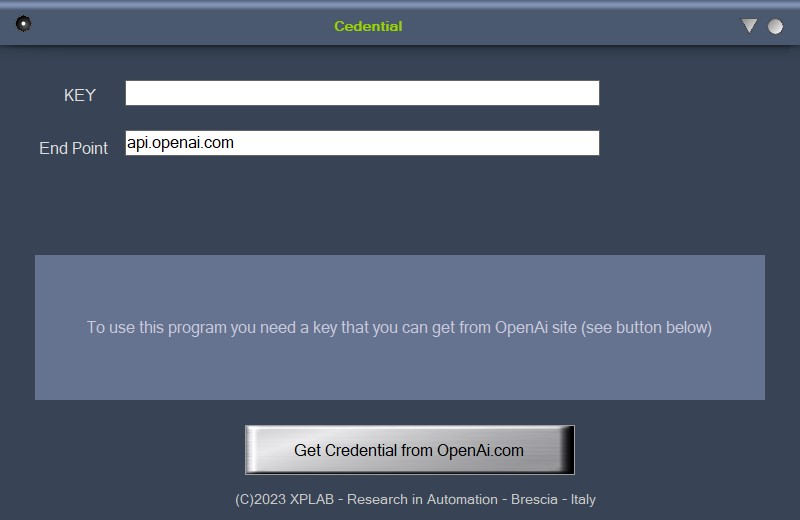
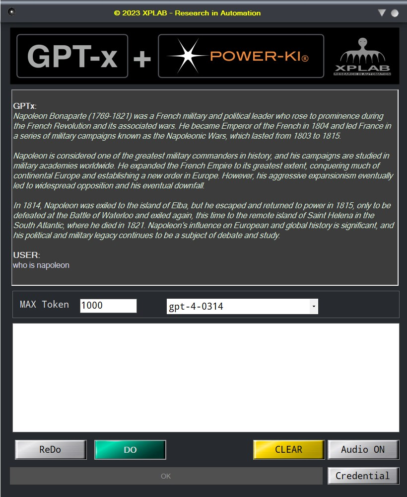

# GPT-DEMO-01
This program is a very basic implementation of the GPT chat, the use is simple, a KEY that you can get from openai site is required.

<figure>
    
    <figcaption>First you have to insert your credential</figcaption>
</figure>

 
 

<figure>
    
    <figcaption>The chat page</figcaption>
</figure>

GET the program:
<a href="https://github.com/POWER-KI/GPT/raw/main/DEMO-01/GPT-DEMO-01.pwk"> GPT-DEMO-01.pwk</a>

NOTE. Credential are stored on YOUR computer only.

## Plain text code

[Code list](DEMO-01.pdf)

