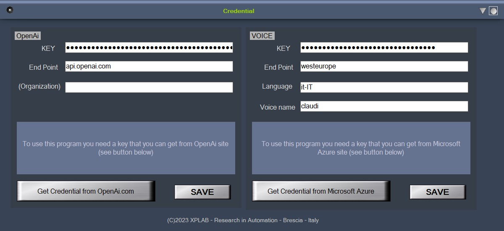
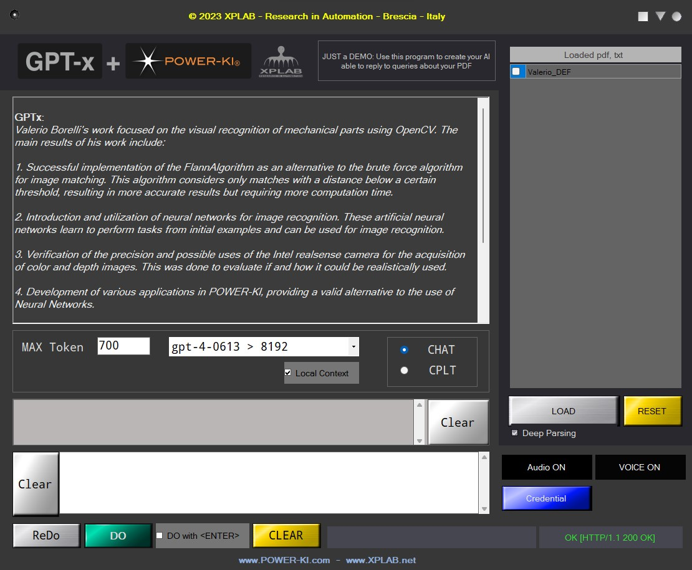
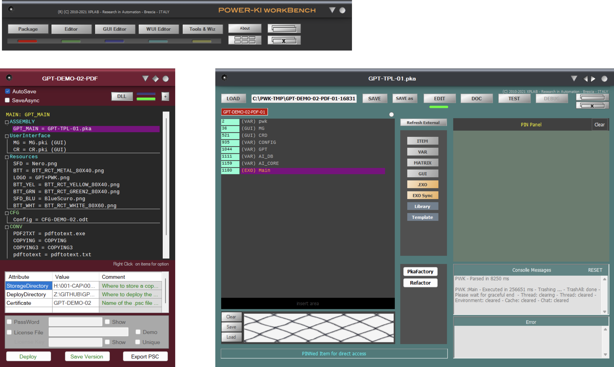

# GPT-DEMO-02 V2 
With this software, you can create a knowledge base of your documents (.pdf, .txt) on your PC, which you can query, also with voice command, using GPT. Manuals, user guides, and notes become a source of information for answers to your questions.

----
This is  a  FREE software demonstrating how by combining POWER-KI programming language and OpenAi's GPT interesting results can be obtained in a simple and compact way. 

It is supplied in Open Source executable to allow interested parties to study it.

See other demo in our<a href="https://github.com/POWER-KI/GPT"> GPT DEMO page</a>. 

## Privacy
All information Credential, Documents Data Base are stored on your computer; for embedding documents are sent in fragments to openAi, and also part of the content for creating responses.

## DESCRIPTION
When starting the program, if it has not already been entered, the OpenAi KEY is requested. In this case, a button allows you to access the OpenAi web page where you can register, the key thus obtained can be inserted in the program page, and will be kept on your computer for subsequent accesses.

<figure>
    
    <figcaption>First you have to insert your credential</figcaption>
</figure>

Once this operation has been carried out, you access the main page of the application whose main elements are:
* a box where the replies and the history of the chat are displayed;
* the settings area (see below);
* a box to enter directives for GPT;
* a box for entering questions;
* the buttons area;
* the information zone.

The right side of the page displays the documents (Pdf, txt)  which you have uploaded to your database (that is local on your PC), and the button to carry out these uploads.
 

<figure>
    
    <figcaption>The chat page with the list of your documents</figcaption>
</figure>

# GET the program:
Starting from Build 35.23, this app is included in 
 <a href="https://github.com/POWER-KI/POWER-KI/raw/master/INSTALL-PACKAGE/Setup_PWK-EXC_PUB01.msi" download> POWER-KI executor</a> 
 or  <a href="https://github.com/POWER-KI/POWER-KI/raw/master/INSTALL-PACKAGE/Setup_POWER-KI_PUB01.msi" download> POWER-KI Development environment</a>. 
To run it, launch the "Calcolatrice" application from your desktop.
 
<figure>
	        
</figure>

The download of the single<b><a href="https://github.com/POWER-KI/GPT/raw/main/DEMO-02/GPT-DEMO-02-PDF.pwk"> GPT-DEMO-02-PDF.pwk</a> executable.

(last update : 12/05/23)

# Notes for programmers
<figure>
        
</figure>

This program in perfect POWER-KI style is complete, meaning it doesn't have the boring dependencies typical of other systems. Being a demo it has some limitations but since it is provided in executable source form, can be studied and modified.

The application parts specific to GPT are:
- (VAR) GPT:    interfacing with OpenAi API;
- (VAR) AI_DB:  management of the Vector-fragment Database; 
- (VAR) AI_CORE: execution of queries to GPT. 

Uploaded documents (.pdt, .txt) are saved in GPT_PDF.DB and GPT_PDF.VCT

## Plain text code
[Plain Code list](DEMO-02.pdf)

## Remarks
XPLAB gives no guarantee as to its functioning, its reliability and the validity of the results and answers it can provide.
It is supplied in Open Source executable to allow interested parties to study it.
This package contains XPLAB non-production software created and copyrighted (1996-2021) by Glyph & Cog, LLC, distributed in executable form as directed by them.

### ABOUT
<a href="https://github.com/POWER-KI"> POWER-KI on GitHub</a>  
<a href="http://www.power-ki.com"> POWER-KI official site</a>  
<a href="http://www.xplab.net"> XPLAB site</a> 

(C) 2023 XPLAB - Research in Automation - Brescia -ITALY  
(C) 2010-2023 POWER-KI(R) by XPLAB
