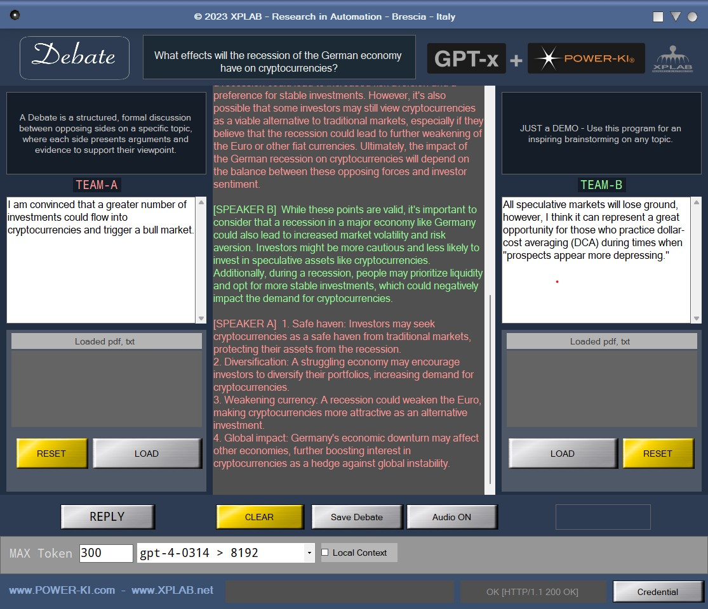
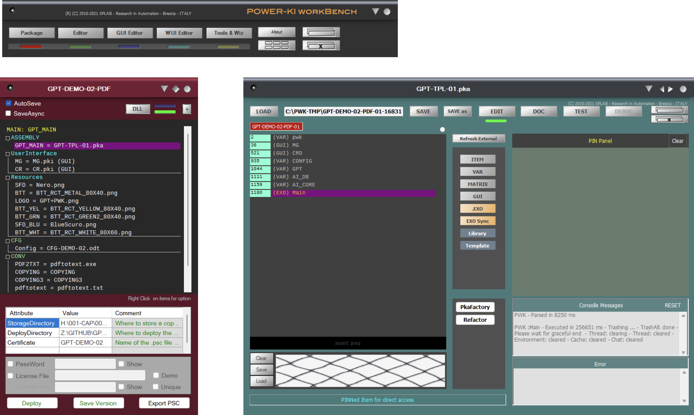

# GPT-DEMO-03: DEBATE
<i>A <b>DEBATE</b> is a structured, formal discussion between opposing sides on a specific topic, where each side presents arguments and evidence to support their viewpoint. 
<b>This software</b> allows the comparison between two teams with different opinions, using the capabilities of OpenAI models. Each TEAM also has the option to upload .pdf or .txt documents in support of their position.</i>

This tool also you to compare the different opinions available on the internet, or if we move to a personal level, it helps to clarify one's thoughts in the presence of a dilemma. If used as an educational tool, it allows students to research facts and build documents to support their thesis, then checking how the debate evolves. 
In addition to all this, but no less important, it helps to better understand how GPT works.

Examples of debate:
- Topic: Which came first, the egg or the chicken?
- TEAM A: Definitely the egg.
- TEAM B: Without the chicken, there's no egg.

Or less trivial:
- Topic: Is artificial intelligence dangerous?
- TEAM A: Yes, it can dominate the world.
- TEAM B: No, it's just a tool that will help the progress of humanity.

NOTE. With GPT-4 works well, with GPT-3.5 does not understand when to stop the debate :-)

----
This is  a  FREE software demonstrating how by combining POWER-KI programming language and OpenAi's GPT interesting results can be obtained in a simple and compact way. 

It is supplied in Open Source executable to allow interested parties to study it.

See other demo in our<a href="https://github.com/POWER-KI/GPT"> GPT DEMO page</a>. 

## Privacy
All information Credential, Documents Data Base are stored on your computer; for embedding documents are sent in fragments to openAi, and also part of the content for creating responses.

## USE
When starting the program, if it has not already been entered, the OpenAi KEY is requested. In this case, a button allows you to access the OpenAi web page where you can register, the key thus obtained can be inserted in the program page, and will be kept on your computer for subsequent accesses.

<figure>
    
    <figcaption>First you have to insert your credential</figcaption>
</figure>

Once this operation has been carried out, you access the main page 

<figure>
    
</figure>

# EXAMPLE
For the topic of the picture, the complete debate text:

'
[SPEAKER A] 
1. Safe haven: Investors may seek cryptocurrencies as a safe haven from traditional markets, protecting their assets from the recession.
2. Diversification: A struggling economy may encourage investors to diversify their portfolios, increasing demand for cryptocurrencies.
3. Weakening currency: A recession could weaken the Euro, making cryptocurrencies more attractive as an alternative investment.
4. Global impact: Germany's economic downturn may affect other economies, further boosting interest in cryptocurrencies as a hedge against global instability.

[SPEAKER B] While these points are valid, it's important to consider that a recession in a major economy like Germany could also lead to increased market volatility and risk aversion. Investors might be more cautious and less likely to invest in speculative assets like cryptocurrencies. Additionally, during a recession, people may prioritize liquidity and opt for more stable investments, which could negatively impact the demand for cryptocurrencies.

[SPEAKER A] That's a valid counter-argument. It's true that a recession could lead to increased risk aversion and a preference for stable investments. However, it's also possible that some investors may still view cryptocurrencies as a viable alternative to traditional markets, especially if they believe that the recession could lead to further weakening of the Euro or other fiat currencies. Ultimately, the impact of the German recession on cryptocurrencies will depend on the balance between these opposing forces and investor sentiment.

[SPEAKER B] I agree that the impact of the German recession on cryptocurrencies will depend on the balance between risk aversion and the search for alternative investments. For those who practice dollar-cost averaging (DCA), this could be an opportunity to invest in cryptocurrencies at lower prices, potentially benefiting from future market recoveries. However, it's essential for investors to carefully assess their risk tolerance and investment strategies during such uncertain times.

[SPEAKER A] I concur with your assessment. The German recession's impact on cryptocurrencies will indeed be influenced by the balance between risk aversion and the pursuit of alternative investments. Dollar-cost averaging could be a viable strategy for some investors, allowing them to capitalize on potential market recoveries. However, it is crucial for investors to evaluate their risk tolerance and investment strategies in the face of economic uncertainty. In conclusion, the effects of the German recession on cryptocurrencies will vary depending on individual investor behavior and market sentiment.

[SPEAKER B] I agree with your conclusion. The German recession's impact on cryptocurrencies will be determined by individual investor behavior, market sentiment, and the balance between risk aversion and the pursuit of alternative investments. Dollar-cost averaging may be a suitable strategy for some investors, but it is essential to carefully assess risk tolerance and investment strategies during uncertain times. With that said, I believe we have reached a common point and can consider this debate closed.
'

# GET the program:
Starting from Build 35.23, this app is included in 
 <a href="https://github.com/POWER-KI/POWER-KI/raw/master/INSTALL-PACKAGE/Setup_PWK-EXC_PUB01.msi" download> POWER-KI executor</a> 
 or  <a href="https://github.com/POWER-KI/POWER-KI/raw/master/INSTALL-PACKAGE/Setup_POWER-KI_PUB01.msi" download> POWER-KI Development environment</a>. 
 To run it, launch the "Calcolatrice" application from your desktop.
 

<figure>
        
</figure>

The download of the single<b><a href="https://github.com/POWER-KI/GPT/raw/main/DEMO-03/GPT-DEMO-03-DEBATE.pwk"> GPT-DEMO-03-DEBATE.pwk</a>  executable

(last update : 12/05/23)

# Notes for programmers
<figure>
        
</figure>

This program in perfect POWER-KI style is complete, meaning it doesn't have the boring dependencies typical of other systems. Being a demo it has some limitations but since it is provided in executable source form, can be studied and modified.

The application parts specific to GPT are:
- (VAR) GPT:    interfacing with OpenAi API;
- (VAR) AI_DB:  management of the Vector-fragment Database; 
- (VAR) AI_CORE: execution of queries to GPT. 

## Remarks
XPLAB gives no guarantee as to its functioning, its reliability and the validity of the results and answers it can provide.
It is supplied in Open Source executable to allow interested parties to study it.
This package contains XPLAB non-production software created and copyrighted (1996-2021) by Glyph & Cog, LLC, distributed in executable form as directed by them.

### ABOUT
<a href="https://github.com/POWER-KI"> POWER-KI on GitHub</a> 
<a href="http://www.power-ki.com"> POWER-KI official site</a>  
<a href="http://www.xplab.net"> XPLAB site</a> 

(C) 2023 XPLAB - Research in Automation - Brescia -ITALY  
(C) 2010-2023 POWER-KI(R) by XPLAB
