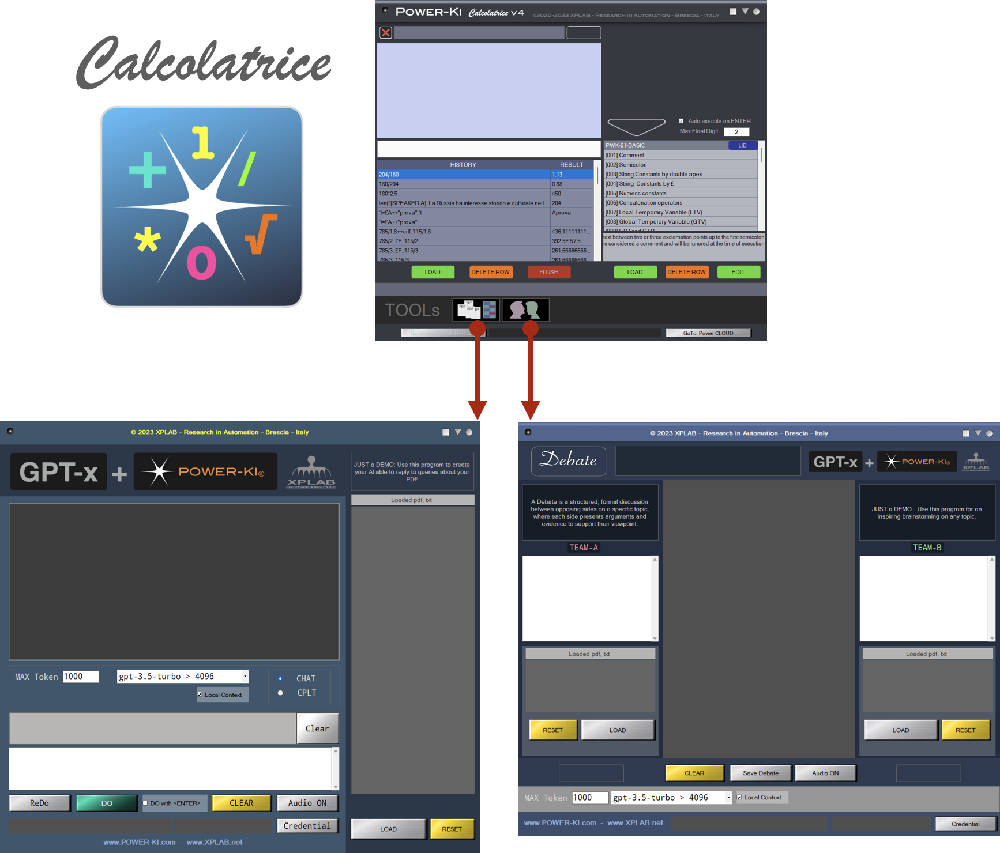

# GPT
<a href="http://www.power-ki.com">POWER-KI</a> is the perfect complement to create intelligent applications that make use of GPT technologies.
in this repository we will publish some examples that can be freely downloaded.

For their execution the <a href="https://github.com/POWER-KI/POWER-KI/raw/master/INSTALL-PACKAGE/Setup_PWK-EXC_PUB01.msi" download> POWER-KI executor</a> must be installed. 

If, on the other hand, you want to examine the code to study or modify it, install the  <a href="https://github.com/POWER-KI/POWER-KI/raw/master/INSTALL-PACKAGE/Setup_POWER-KI_PUB01.msi" download> POWER-KI Development environment</a>.

These are just demos, but if you need <b>powerful CUSTOM applications</b>, you can contact us <a href="http://xplab.net/CONTACTS_EN.html"> XPLAB</a>.

<figure>
        
</figure>

<b>NOTE: 
* DEMO-02 and DEMO-03 are now enclosed in POWER-KI distributions DEV and EXEC and can be executed from Calcolatrice;
* Updated with last GPT Models. </b>

## DEMO

*  <a href="https://github.com/POWER-KI/GPT/tree/main/DEMO-01"> DEMO-01 </a>  simple GPT chat
*  <a href="https://github.com/POWER-KI/GPT/tree/main/DEMO-02"> DEMO-02 </a>  query your database of .pdf, .txt documents with GPT 
*  <a href="https://github.com/POWER-KI/GPT/tree/main/DEMO-03"> DEMO-03 </a>  DEBATE "Which came first, the egg or the chicken?"

## ABOUT
<a href="https://github.com/POWER-KI"> POWER-KI on GitHub</a> 

<a href="http://www.power-ki.com"> POWER-KI official site</a> 

<a href="http://www.xplab.net"> XPLAB site</a> 

(C) 2023 XPLAB - Research in Automation - Brescia -ITALY

(C) 2010-2023 POWER-KI(R) by XPLAB
