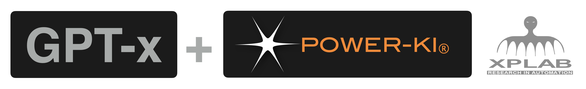

# GPT
<a href="http://www.power-ki.com">POWER-KI</a> is the perfect complement to create intelligent applications that make use of GPT technologies.
in this repository we will publish some examples that can be freely downloaded.

The DEMO are enclosed in POWER-KI distribution:
* just execute: <a href="https://github.com/POWER-KI/POWER-KI/raw/master/INSTALL-PACKAGE/Setup_PWK-EXC_PUB01.msi" download> download POWER-KI executor</a>. 
* If, on the other hand, you want to examine the code to study or modify it, install the  <a href="https://github.com/POWER-KI/POWER-KI/raw/master/INSTALL-PACKAGE/Setup_POWER-KI_PUB01.msi" download> POWER-KI Development environment</a>.

These are just demos, but if you need <b>powerful CUSTOM applications</b>, you can contact us <a href="http://xplab.net/CONTACTS_EN.html"> XPLAB</a>.

<figure>
        
</figure>

## DEMO

*  <a href="https://github.com/POWER-KI/GPT/tree/main/DEMO-02"> DEMO-02: GPT-PDF  </a>  chat with your database of .pdf, .docx, .pptx, .odt, .ods, .txt documents with GPT. 
*  <a href="https://github.com/POWER-KI/GPT/tree/main/DEMO-03"> DEMO-03: GPT-DEBATE  </a> "Which came first, the egg or the chicken?".

## TRAIN GPT on POWER-KI programming
<a href="https://github.com/POWER-KI/GPT/tree/main/DOC/readme.md">Documents</a> useful for GPT train and uderstanding POWER-KI programming.  

## ABOUT
<a href="https://github.com/POWER-KI"> POWER-KI on GitHub</a> 

<a href="https://www.power-ki.com"> POWER-KI official site</a> 

<a href="https://www.xplab.net"> XPLAB site</a> 

(C) 2023 XPLAB - Research in Automation - Brescia -ITALY

(C) 2010-2023 POWER-KI(R) by XPLAB
